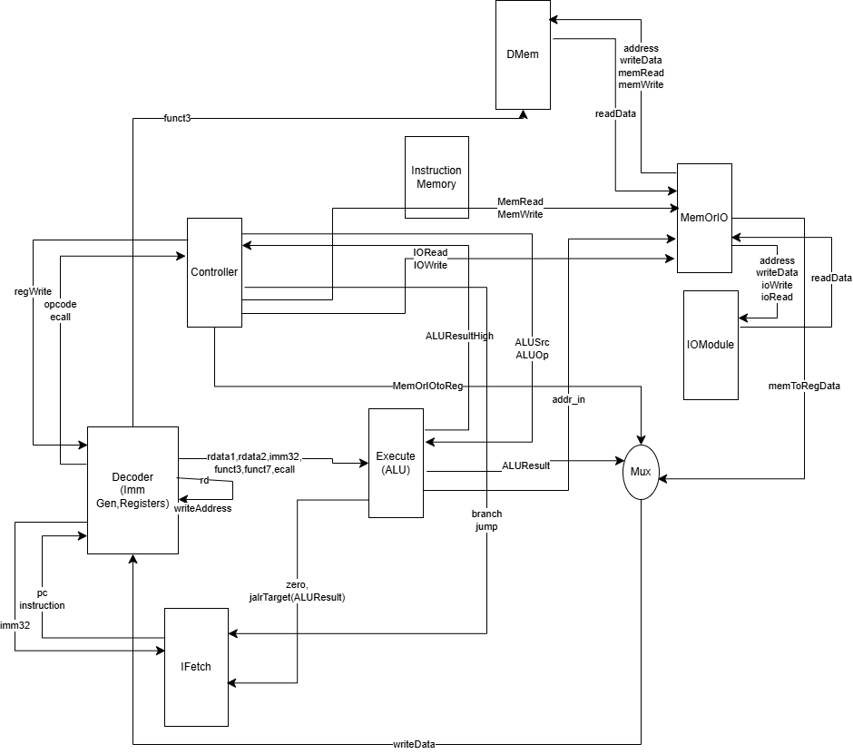

# CPU设计项目中期答辩报告

## 一、小组信息
- 小组成员：
  - 胡豪展（12310617）赵勋（12312606）李泽均（12311010）
- 实验课时间：周一 5-6 王晴

---

## 二、代码规范约定
- **结构化设计**：
  - 是否采用结构化模块设计：是，详见第四部分模块关系图
- **命名规范**：
  - 信号命名：以蛇型命名为主
  - 模块命名：驼峰式
- **注释要求**：
  - 每个模块顶部包含模块功能、端口旁有端口说明
  - 关键逻辑处添加行内注释
- **符号化常量定义与使用**：
  - 使用参数化方式声明常量(如Decoder中OPCODE_RTYPE等)

---

## 三、CPU特性说明
- **设计类型**：单周期，五级流水线，全局主时钟
- **支持的指令集合**：

    R-type: add, sub, and, or

    I-type: addi, lw, jalr

    S-type: sw

    SB-type: beq, bne, blt

    UJ-type: jal

    U-type: auipc

    系统指令: ecall（其中 funct = 0 为读，funct = 1 为写）

---

## 四、CPU架构设计
### 1. 内部模块划分
- 控制单元（Control Unit） Controller.v
- 指令译码器（Decoder） Decoder.v
- 寄存器堆（Register File）In Decoder.v
- 算术逻辑单元（ALU）Execute.v
- 程序计数器（PC）IFetch.v
- 数据存储器（Data Memory）DMem.v
- 其他模块（如分支预测器等）

### 2. 模块连接关系图

## 五、CPU指令与控制信号关系

| 指令类型 | 指令  | ALUSrc | MemtoReg | RegWrite | MemRead | MemWrite | Branch | Jump | 控制信号说明                |
| -------- | ----- | ------ | -------- | -------- | ------- | -------- | ------ | ---- | --------------------------- |
| R-type   | add   | 0      | 0        | 1        | 0       | 0        | 0      | 0    | ALU操作, 写寄存器           |
| R-type   | sub   | 0      | 0        | 1        | 0       | 0        | 0      | 0    | ALU操作, 写寄存器           |
| R-type   | and   | 0      | 0        | 1        | 0       | 0        | 0      | 0    | ALU操作, 写寄存器           |
| R-type   | or    | 0      | 0        | 1        | 0       | 0        | 0      | 0    | ALU操作, 写寄存器           |
| I-type   | addi  | 1      | 0        | 1        | 0       | 0        | 0      | 0    | 立即数运算, 写寄存器        |
| I-type   | lw    | 1      | 1        | 1        | 1       | 0        | 0      | 0    | 读取内存, 写寄存器          |
| I-type   | jalr  | 0      | 0        | 0        | 0       | 0        | 1      | 1    | 跳转寄存器, 不写寄存器      |
| S-type   | sw    | 1      | 0        | 0        | 0       | 1        | 0      | 0    | 写内存                      |
| SB-type  | beq   | 0      | 0        | 0        | 0       | 0        | 1      | 0    | 比较操作，条件跳转          |
| SB-type  | bne   | 0      | 0        | 0        | 0       | 0        | 1      | 0    | 比较操作，条件跳转          |
| SB-type  | blt   | 0      | 0        | 0        | 0       | 0        | 1      | 0    | 比较操作，条件跳转          |
| UJ-type  | jal   | 0      | 0        | 0        | 0       | 0        | 1      | 1    | 跳转指令, 不写寄存器        |
| U-type   | auipc | 1      | 0        | 1        | 0       | 0        | 0      | 0    | 计算PC相对地址, 写寄存器    |
| U-type   | lui   | 1      | 0        | 1        | 0       | 0        | 0      | 0    | 加载高位立即数, 写寄存器    |
| 系统指令 | ecall | 0      | 0        | 0        | 0       | 0        | 0      | 0    | funct=0 (读) / funct=1 (写) |

---

## 六、已完成的代码与测试场景
### 已完成模块：
Controller,Execute(ALU),Decoder,DMem,IFetch,MemOrIO,IOModule,PipelineRegister

### 已搭建的测试场景：上述对应模块的testbench

---

## 七、计划使用/开发的工具链
- **开发语言**：Verilog
- **仿真工具**：Vivado
- **综合工具**：Vivado
- **调试工具**：自定义Testbench
- **管理工具**：Git,GitHub 

---

## 八、项目进度与后续计划
### 当前进度：
- 已完成：单周期CPU模块全部完成。基础指令已完成。
- 正在进行：单周期CPU上版测试。单周期改五级流水线，处理Data Hazard,Control Hazard等冒险

### 当前困难或问题：
- 数据通路存在冒险未完全解决、控制单元逻辑复杂

### 预计最终答辩时间：
- 15周

### 后续计划：
- 实现对复杂外设接口的支持
- 实现只烧写一次FPGA芯片，可通过uart接口实现多个测试场景之间的切换
- 优化流水线冲突处理
- 编写更多测试用例
